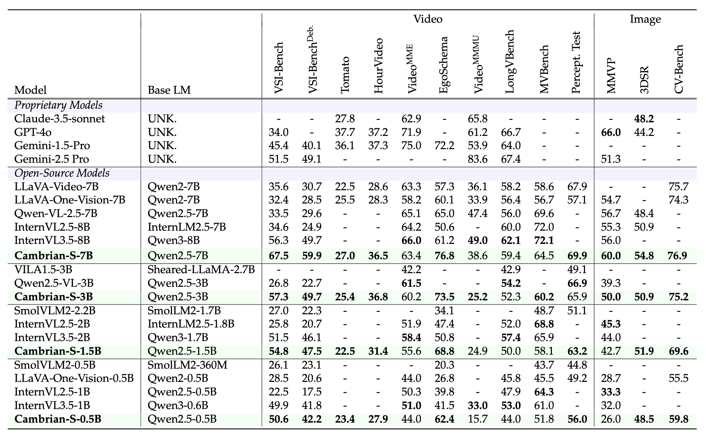
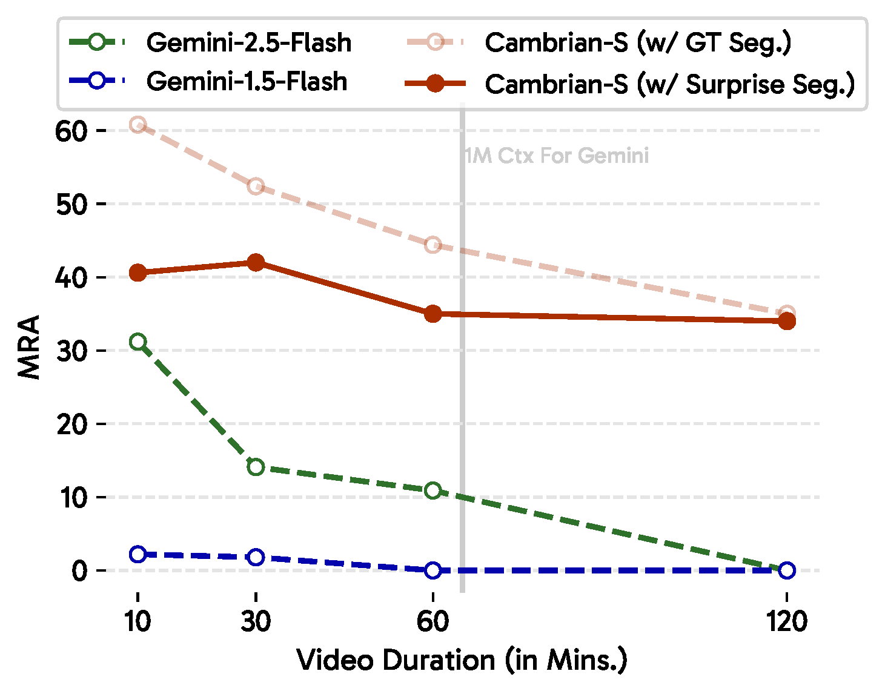
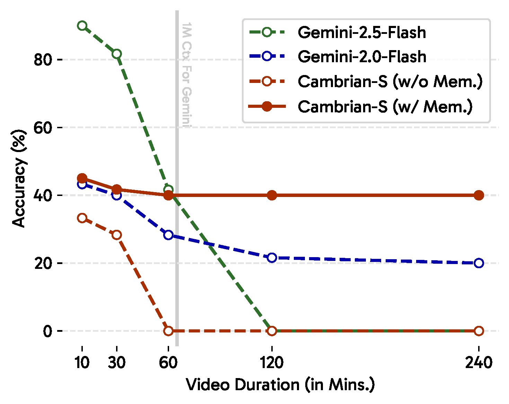
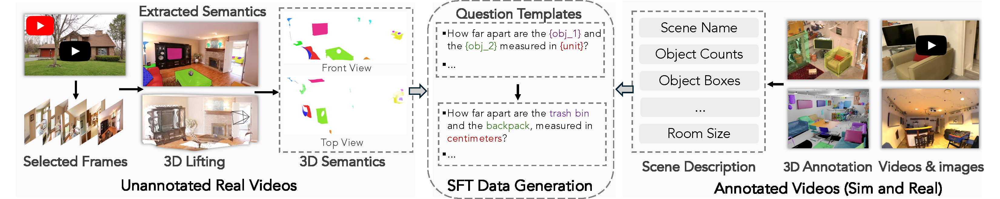
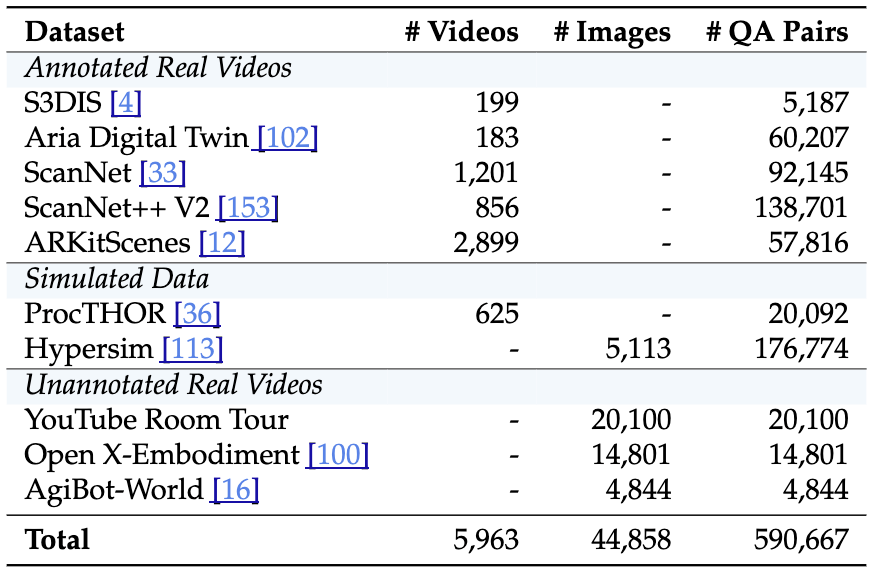
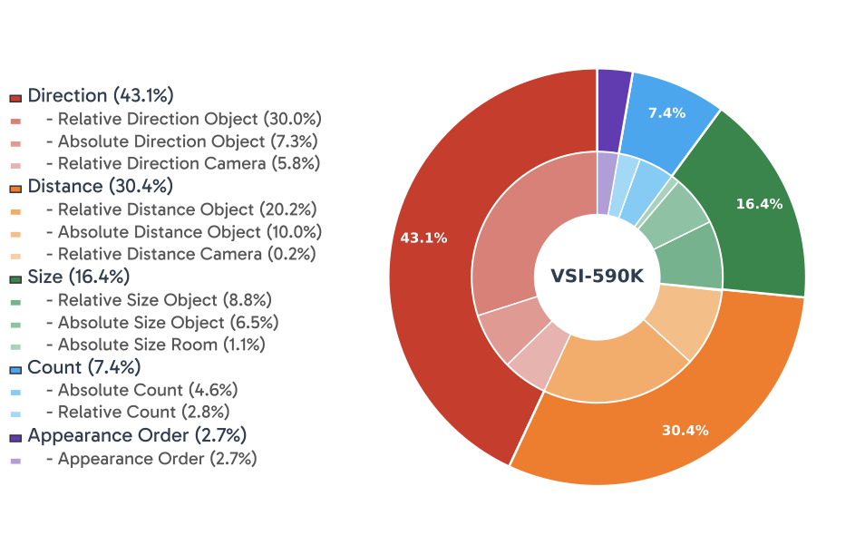
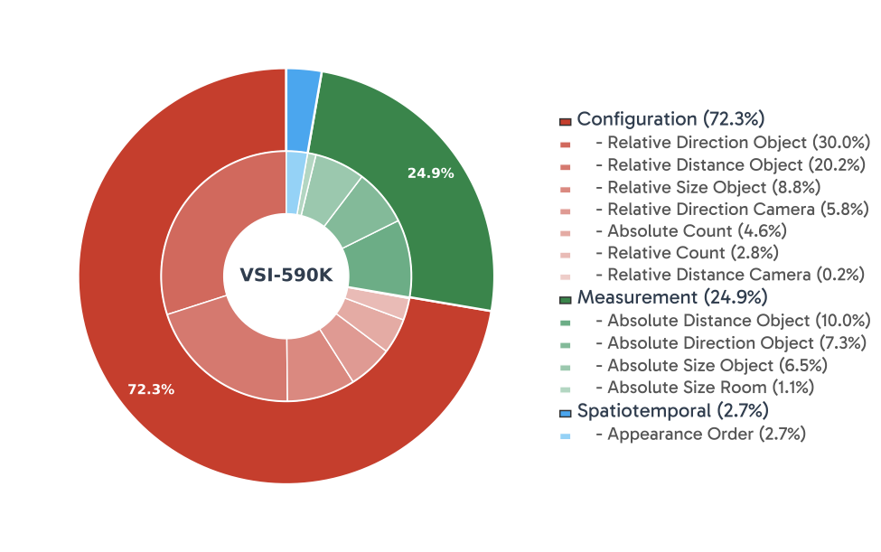

<div align="center">

#  *Cambrian-S*:<br> Towards Spatial Supersensing in Video


<p>
    
</p>

<a href="https://arxiv.org/abs/2511.04670" target="_blank">
    
</a>
<a href="https://cambrian-mllm.github.io/cambrian-s/" target="_blank">
    
</a>
<a href="https://huggingface.co/collections/nyu-visionx/cambrian-s-models" target="_blank">
    
</a>
<a href="https://huggingface.co/datasets/nyu-visionx/VSI-590K" target="_blank">
    
</a>
<a href="https://huggingface.co/collections/nyu-visionx/vsi-super" target="_blank">
    
</a>
<div style="font-family: charter;">
    <a href="https://github.com/vealocia" target="_blank">Shusheng Yang*</a>,
    <a href="https://jihanyang.github.io/" target="_blank">Jihan Yang*</a>,
    <a href="https://pinzhihuang.github.io/" target="_blank">Pinzhi Huang†</a>,
    <a href="https://ellisbrown.github.io/" target="_blank">Ellis Brown†</a>,
    <a href="https://redagavin.github.io/" target="_blank">Zihao Yang</a>,
    <br>
    <a href="https://github.com/czyuyue" target="_blank">Yue Yu</a>,
    <a href="https://tsb0601.github.io/" target="_blank">Shengbang Tong</a>,
    <a href="#" target="_blank">Zihan Zheng</a>,
    <a href="https://www.yfxu.com/" target="_blank">Yifan Xu</a>,
    <a href="https://github.com/wang-muhan" target="_blank">Muhan Wang</a>,
    <a href="https://daohanlu.github.io/" target="_blank">Daohan Lu</a>,
    <br>
    <a href="https://cs.nyu.edu/~fergus/pmwiki/pmwiki.php" target="_blank">Rob Fergus</a>,
    <a href="http://yann.lecun.com/" target="_blank">Yann LeCun</a>,
    <a href="https://profiles.stanford.edu/fei-fei-li" target="_blank">Li Fei-Fei</a>,
    <a href="https://www.sainingxie.com/" target="_blank">Saining Xie</a>
</div>

<div style="font-family: charter;">
*Equal Contribution&nbsp;&nbsp;&nbsp;&nbsp;†Core Contributor
</div>

</div>

## Release
- [Nov 6, 2025] 🔥 We release Cambrian-S model weights, training code, and evaluation suite.
- [Nov 6, 2025] 🔥 We release VSI-SUPER, a benchmark designed for spatial supersensing.
- [Nov 6, 2025] 🔥 We release VSI-590K, a dataset curated for spatial sensing.

## Contents
- [ *Cambrian-S*: Towards Spatial Supersensing in Video](#-cambrian-s-towards-spatial-supersensing-in-video)
  - [Release](#release)
  - [Contents](#contents)
  - [Cambrian-S Weights](#cambrian-s-weights)
    - [General Model Performance](#general-model-performance)
    - [VSI-SUPER Performance](#vsi-super-performance)
    - [Model Card](#model-card)
      - [Model Trained with Predictive Sensing](#model-trained-with-predictive-sensing)
      - [Standard MLLM Models](#standard-mllm-models)
  - [VSI-590K Dataset](#vsi-590k-dataset)
  - [Train](#train)
  - [Evaluation](#evaluation)
  - [Citation](#citation)
  - [Related Projects](#related-projects)

## Cambrian-S Weights

Here are our Cambrian-S checkpoints along with instructions on how to use the weights. Our models excel at spatial reasoning in video understanding, demonstrating significant improvements over previous state-of-the-art methods on spatial understanding benchmarks while maintaining competitive performance on general video understanding tasks.

### General Model Performance

Comparison of Cambrian-S with other leading MLLMs on general video understanding benchmarks.

<p align="center">
    
</p>

**Results**: Cambrian-S maintains competitive performance on standard video benchmarks (Perception Test and EgoSchema) while excelling at spatial reasoning tasks.

### VSI-SUPER Performance

VSI-SUPER performance is evaluated on **Cambrian-S-7B-LFP**. 

<div align="center" style="display: flex; justify-content: center; gap: 10px; width:100%">
    
    
</div>


### Model Card

#### Model Trained with Predictive Sensing

| Model           | Base-LLM | Vision Encoder | Hugging Face                                                    |
|-----------------|------------|----------------|------------------------------------------------------------------|
| Cambrian-S-7B-LFP   | `Qwen2.5-7B-Instruct`         | `siglip2-so400m-patch14-384`     | [nyu-visionx/Cambrian-S-7B-LFP](https://huggingface.co/nyu-visionx/Cambrian-S-7B-LFP)   |

#### Standard MLLM Models

| Model           | Base-LLM | Vision Encoder | Hugging Face                                                    |
|-----------------|------------|----------------|------------------------------------------------------------------|
| Cambrian-S-7B   | `Qwen2.5-7B-Instruct`         | `siglip2-so400m-patch14-384`     | [nyu-visionx/Cambrian-S-7B](https://huggingface.co/nyu-visionx/Cambrian-S-7B)   |
| Cambrian-S-3B   | `Qwen2.5-3B-Instruct`         | `siglip2-so400m-patch14-384`     | [nyu-visionx/Cambrian-S-3B](https://huggingface.co/nyu-visionx/cambrian-s-3b)   |
| Cambrian-S-1.5B | `Qwen2.5-1.5B-Instruct`       | `siglip2-so400m-patch14-384`     | [nyu-visionx/Cambrian-S-1.5B](https://huggingface.co/nyu-visionx/cambrian-s-1.5b) |
| Cambrian-S-0.5B | `Qwen2.5-0.5B-Instruct`       | `siglip2-so400m-patch14-384`     | [nyu-visionx/Cambrian-S-0.5B](https://huggingface.co/nyu-visionx/cambrian-s-0.5b) | 

## VSI-590K Dataset

VSI-590K is a video instruction-tuning dataset focusing on spatial understanding. 

<p align="center">
    
</p>


**VSI-590K dataset statistics.** 

<p align="center">
    
</p>

QAs are grouped by: question types (left) and task groups (right).

<div align="center" style="display: flex; justify-content: center; gap: 0px; width:100%">
    
    
</div>

**Hugging Face**: [nyu-visionx/VSI-590K](https://huggingface.co/datasets/nyu-visionx/vsi-590k)


## Train

We are working on cleaning and re-organizing our TPU-based training code, please stay tuned!

## Evaluation

We have released our evaluation code in the [`lmms-eval/`](lmms-eval/) subfolder. Please see the README there for more details.

For detailed benchmark results, please refer to the [General Model Performance](#general-model-performance) and [VSI-SUPER Performance](#vsi-super-performance) sections above.

## Citation

If you find our work useful for your research, please consider to cite our work:

```bibtex
@article{yang2025cambrians,
  title={Cambrian-S: Towards Spatial Supersensing in Video},
  author={Yang, Shusheng and Yang, Jihan and Huang, Pinzhi and Brown, Ellis and Yang, Zihao and Yu, Yue and Tong, Shengbang and Zheng, Zihan and Xu, Yifan and Wang, Muhan and Lu, Daohan and Fergus, Rob and LeCun, Yann and Fei-Fei, Li and Xie, Saining},
  journal={arXiv preprint arXiv:2511.04670},
  year={2025}
}

@article{brown2025shortcuts,
  author = {Brown, Ellis and Yang, Jihan and Yang, Shusheng and Fergus, Rob and Xie, Saining},
  title = {Benchmark Designers Should ``Train on the Test Set'' to Expose Exploitable Non-Visual Shortcuts},
  journal = {arXiv preprint arXiv:2511.04655},
  year = {2025}
}

@article{brown2025simsv,
  title   =  { {SIMS-V}: Simulated Instruction-Tuning for Spatial Video Understanding },
  author  =  { Brown, Ellis and Ray, Arijit and Krishna, Ranjay and Girshick, Ross and Fergus, Rob and Xie, Saining },
  journal =  { arXiv preprint arXiv:2511.04668 },
  year    =  { 2025 }
}

@article{yang2024think,
    title={{Thinking in Space: How Multimodal Large Language Models See, Remember and Recall Spaces}},
    author={Yang, Jihan and Yang, Shusheng and Gupta, Anjali W. and Han, Rilyn and Fei-Fei, Li and Xie, Saining},
    year={2024},
    journal={arXiv preprint arXiv:2412.14171},
}

@article{tong2024cambrian,
  title={{Cambrian-1: A Fully Open, Vision-Centric Exploration of Multimodal LLMs}},
  author={Tong, Shengbang and Brown, Ellis and Wu, Penghao and Woo, Sanghyun and Middepogu, Manoj and Akula, Sai Charitha and Yang, Jihan and Yang, Shusheng, and Iyer, Adithya and Pan, Xichen and Wang, Austin and Fergus, Rob and LeCun, Yann and Xie, Saining},
  journal={arXiv preprint arXiv:2406.16860},
  year={2024}
}
```

## Related Projects

- [Cambrian-1](https://github.com/cambrian-mllm/cambrian): A Fully Open, Vision-Centric Exploration of Multimodal LLMs
- [Thinking in Space](https://vision-x-nyu.github.io/thinking-in-space.github.io/): How Multimodal Large Language Models See, Remember and Recall Spaces - Introduces VSI-Bench for evaluating visual-spatial intelligence
- [SIMS-V](https://ellisbrown.github.io/sims-v): Simulated Instruction-Tuning for Spatial Video Understanding
- [Test-Set Stress-Test](https://vision-x-nyu.github.io/test-set-training): Benchmark Designers Should "Train on the Test Set" to Expose Exploitable Non-Visual Shortcuts
